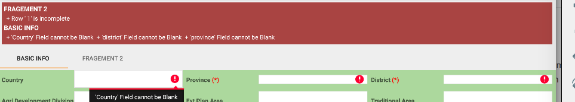

Renderer
########

Whilst the error message on individual fields might be enough for most cases.
There are time you want to display the errors at convenient location that the user can view them all
at ones in at a centralised location.

A good example is when validating fields that :doc:`span multiple fragments <example/fragments>`.
You may want the use to be able to see all errors from each fragment at the very top.

A renderer is a class that implements :java:ref:`RendererInterface<RendererInterface>` it defines
a method :

 - :java:ref:`render(ViewGroup viewGroup) <RendererInterface.render(ViewGroup viewGroup)>` which
   takes in a ViewGroup where the errors will be rendered.

A convenience class :java:ref:`ErrorRenderer<ErrorRenderer>`. It takes in the context and the
validator object on its constructor.

.. code-block:: java

    // the layout where we display any validation errors
    LinearLayout errorSpace = (LinearLayout) findViewById(R.id.error_base);
    errorSpace.removeAllViews();// clear space first

    ErrorRenderer errorRenderer = new ErrorRenderer(this, validator);
    errorRenderer.render(errorSpace);

:ref:`View Example use of ErrorRenderer <handling_errors>`.

.. toctree::
    :maxdepth: 2
    :titlesonly:

    com/eddmash/validation/renderer/package-index